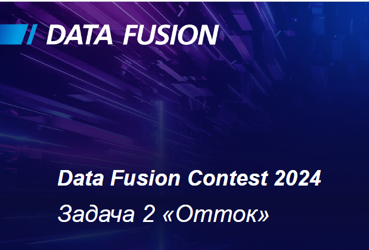

# Data Fusion Contest (1 место)
Data Fusion Contest 2024 Задача 2 «Отток»
Организаторы: [Data Fusion](https://data-fusion.ru/contest.html)  
Площадка: [ODS.ai](https://ods.ai/competitions/data-fusion2024-churn)  

### Задача Хакатона: "Предсказание оттока клиентов банка" 

###### Презентация:
https://docs.google.com/presentation/d/1lZRWapecm5cTdc8KRfE9Ir5v6b-_noMC/edit#slide=id.g1f56ed62cb0_0_673

###### Разбор решения на Data Fusion 2024 (17.04.2024):
Видео разбор решения:
https://data-fusion.ru/programma.html

Решение:
- create_new_features_v1.ipynb - Генератор фичей активности  
- churn_baseline_final.ipynb  - Генератор основных фичей
- Churn_Catboost_params.ipynb - подбор гиперпараметров для CatBoost
- Churn_XGBoost_params.ipynb - подбор гиперпараметров для XGBoost
- Churn_ensamble_top_1.ipynb - Ансамбль 1 версия
- Churn_ensamble_top_2.ipynb - Ансамбль 2 версия

П.С.

